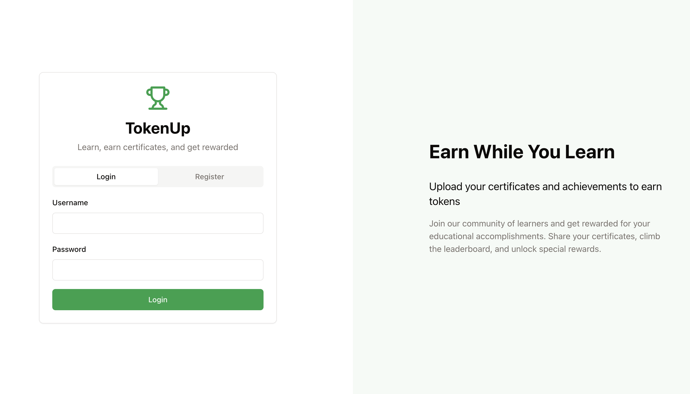
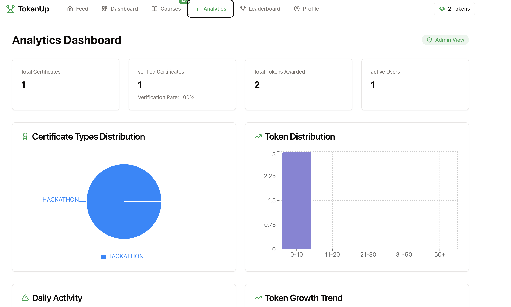

# 🚀 TokenUp

[](https://tokenuo.onrender.com)

Welcome to **TokenUp** – TokenUp is a student-created platform that enhances learning by rewarding academic and professional achievements through blockchain and AI. It uses AI-based OCR and machine learning algorithms to verify certificates and grants tokens as incentives for verified accomplishments. Users interact through a dynamic dashboard featuring real-time activity feeds, leaderboards, and milestone tracking. Top performers each semester earn extra rewards in the form of digital assets or credentials. By combining blockchain’s security with AI’s verification accuracy, TokenUp offers a transparent, scalable, and gamified solution for education, corporate training, and professional development.

## 🖼️ Login Page



## 🖼️ Main App Screenshot



---

## ✨ Features
- 🔒 Secure authentication & session management
- 📊 Real-time analytics and dashboards
- 🪙 Token tracking and management
- 🎨 Beautiful, responsive UI built with Tailwind CSS
- ⚡ Fast, scalable, and easy to deploy

## 🏗️ Tech Stack
- **Frontend:** React, Vite, Tailwind CSS
- **Backend:** Express.js, TypeScript, Drizzle ORM
- **Database:** PostgreSQL (serverless-ready)
- **Session:** Secure sessions with express-session

## 🚦 Getting Started

1. **Install dependencies:**
   ```bash
   npm install
   ```
2. **Add your environment variables:**
   - Copy `.env.example` to `.env` and fill in the required secrets (see `.env` in this repo for reference).
3. **Run the development server:**
   ```bash
   npm run dev
   ```

## 🌍 Live Demo
Check out the deployed app here: [TokenUp Live](https://tokenuo.onrender.com)

## 🤝 Contributing
Pull requests are welcome! For major changes, please open an issue first to discuss what you would like to change.

## 📄 License
[MIT](LICENSE)

---

> Made with ❤️ by the TokenUp team. Happy coding!
